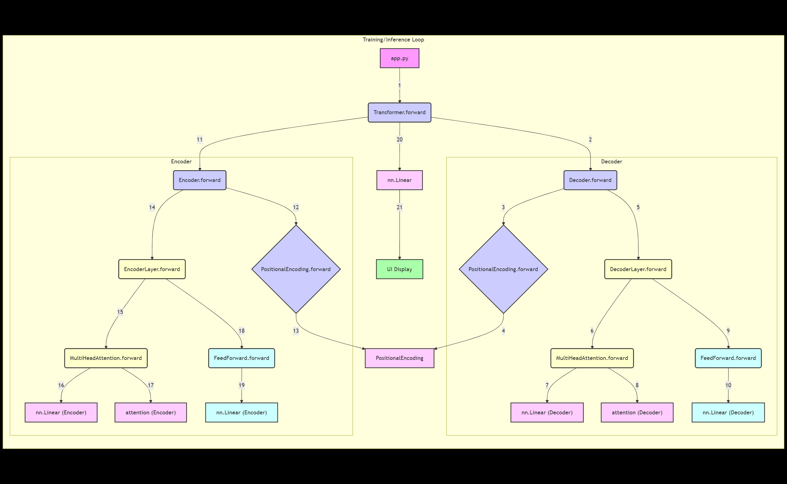
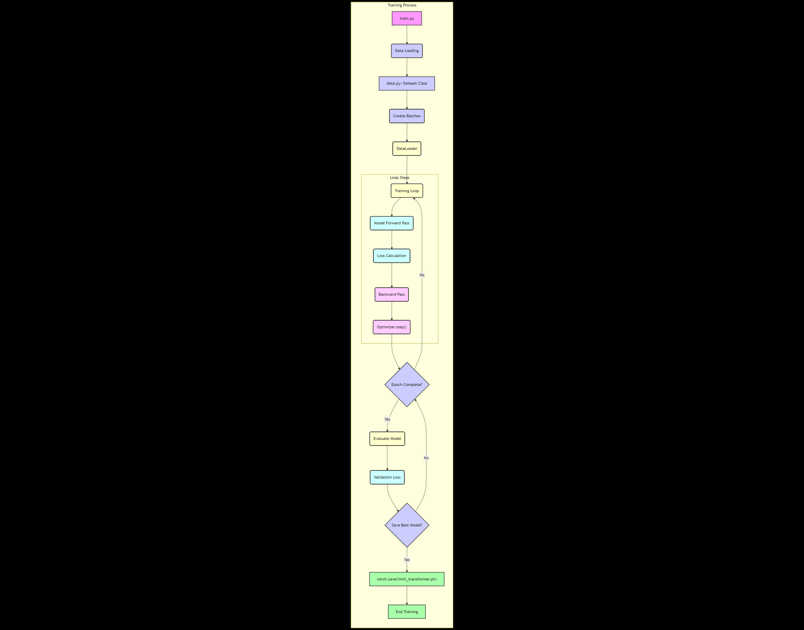

# Miniature Transformer Sentence Completion with Chainlit UI

## Global Design



## Setup

### With pip

```bash
pip install -r requirements.txt
```

##  Train the model:



```python
python train.py
```

## Start the Chainlit UI:
chainlit run app.py

Open the UI at the URL provided, and enter a phrase like the cat sat to see completion.
